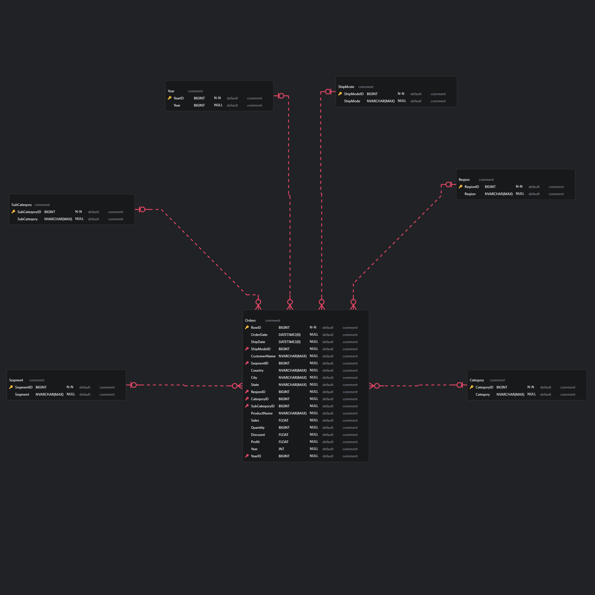

# Project Setup Guide

This README provides step-by-step instructions for setting up the project and working with the provided data. Follow these steps to ensure smooth execution.

---
## Table of Contents

- [Project Overview](#🚀-project-overview)
- [Project Overview](#data-overview)
- [Prerequisites](#prerequisites)
- [Schema Design](#🗂️-schema-design)
- [Steps](#steps)
  - [1. Load Data into Power BI](#1-load-data-into-power-bi)
  - [3. Export Data to SQL Server](#2-export-data-to-sql-server)
  - [3. Write DDL and DML Scripts](#3-write-ddl-and-dml-scripts)
  - [4. Reference the ERD](#4-erdentity-relationship-diagram)
- [Installation Instructions](#installation-instructions)
- [Notes](#notes)

---

## 🚀 Project Overview
This project focuses on the creation of a **Superstore_Final database** using SQL. The database contains:
- **Dimension Tables** (`dim` schema): Stores categorical data (e.g.,  categories, regions, customers).
- **Fact Tables** (`f` schema): Stores transactional data (e.g., Sales, Quantity, Profit).

The aim is to build a scalable and normalized database that can be used for data analysis and business intelligence applications.

## Data Overview

This dataset contains sales transaction data, including details about customer orders, products, and shipping. It is structured to provide insights into various business dimensions such as **Order ID**, **Customer Information**, **Product Categories**, **Sales Performance**, and **Shipping Details**. The dataset includes key metrics like **Sales**, **Quantity**, **Profit**, and **Discount**, which can be used for **Business Intelligence (BI)** analysis to identify trends, optimize sales strategies, and improve inventory management. The data spans multiple years and covers a wide range of product categories, making it ideal for exploring customer behavior, sales performance, and profitability across different regions and segments.


## Prerequisites

Before you begin, make sure you have the following software installed:

1. **Power BI Desktop**
2. **Microsoft SQL Server Management Studio (SSMS)**
3. **Excel**
4. **DAX Studio** (optional but recommended for exporting data)

---

## 🗂️ Schema Design
The **Superstore_Final** database consists of the following schemas and tables:

### **Dimension (dim) Schema:**
- **Segment**: Stores customer segments.
- **ShipMode**: Stores information on shipping modes.
- **Region**: Stores geographical regions.
- **Category**: Stores product categories.
- **SubCategory**: Stores product sub-categories.
- **Year**: Stores year data.

### **Fact (f) Schema:**
- **Orders**: Stores transactional data, such as orders, sales, quantity, and profits.


## Steps

### 1. Load Data into Power BI

- **File Provided**: [Superstore_Edited.xlsx](Dataset\Superstore_Edited.xlsx)
- Open Power BI Desktop and follow these steps:

  1. **Import Data**: 
     - Open Power BI Desktop and go to `File > Import`.
     - Select `Power Query, Power Pivot, Power View` and browse to the `Superstore_Edited.xlsx` file.
     - Load the data into the Power Query editor for transformations.

  2. **Transform Data**:
     - Review the data in Power Query to ensure all columns are correctly typed (e.g., text, numbers, dates).
     - Remove any unnecessary rows or columns and rename fields for clarity.

  3. **Load into Power BI Model**:
     - Click `Close & Apply` in Power Query to load the cleaned data into the Power BI model.


### 2. Export Data to SQL Server

- **Database Setup in SSMS**:
  1. Open SQL Server Management Studio and connect to your server instance.
  2. In the `Object Explorer`, right-click on `Databases` and select `New Database`.
  3. Name the database `Final_Superstore` and click `OK`.

- **Export Data from Power BI**:
  1. Open DAX Studio and connect it to the Power BI model.
  2. Use the `Export Data` feature to save transformed tables as `SQL Tables` files.
  3. Type your `Server Name` and your Database Name in this case `Final_Superstore`

- **Verify Data**:
  - Run basic `SELECT` queries in SSMS to ensure the data has been imported correctly.

### 3. Write DDL and DML Scripts

- **Data Definition Language (DDL)**:
  - Refer to the folder [DDl](https://github.com/aayushsingh2708/Database_Design/tree/main/DDL%20Files).
  - Use the [DDL.ipynb](https://github.com/aayushsingh2708/Database_Design/blob/main/DDL%20Files/DDL.ipynb) file for code with the explanation as well.
  - Use the [DDl.sql](https://github.com/aayushsingh2708/Database_Design/blob/main/DDL%20Files/DDL.sql) for directly using the code in SSMS

- **Data Manipulation Language (DML)**:
  - Refer to the folder [DML](https://github.com/aayushsingh2708/Database_Design/tree/main/DML%20Files).
  - Use the [DML.ipynb](https://github.com/aayushsingh2708/Database_Design/blob/main/DML%20Files/DML.ipynb) file for code with the explanation as well.
  - Use the [DMl.sql](https://github.com/aayushsingh2708/Database_Design/blob/main/DML%20Files/DML.sql) for directly using the code in SSMS
---
### 4. ERD(Entity Relationship Diagram)


- The diagram illustrates the relationships and structure of the database.
- Verify that your SQL Server tables match the structure outlined in the ERD.

---

### Installation Instructions

1. Clone the repository:
   ```bash
   git clone https://github.com/aayushsingh2708/Database_Design.git

---

## Notes

- Ensure consistency between the data model in Power BI and the database schema in SQL Server.
- Validate all transformations and relationships as per the ERD.

---

Happy coding! 🚀
